# Capstone Project DevOps

## In order to proceed with the capstone project we need following infrastructure to be ready 
- Jenkins Server 
- Kubernetes cluster 

It will provision the required infrastructure to host jenkins 

# 1. Create Jenkins Server in AWS using Cloudformation

We are creating the jenkins server using the cloud formation script 

1. Execute the script create jenkins server
```sh
cd cloudformation
./create-jenkins-server.sh

output similar to 
$ cloudformation bharat$ ./create-jenkins-server.sh 
{
    "StackId": "arn:aws:cloudformation:us-east-1:191007734411:stack/capstone-stack/e221a860-28bd-11ed-8628-0ab29b536103"
}
```  

The script will create a stack in cloudformation named as **capstone-stack**. It will create a VPC, an internet gateway, Security Group and an EC2 instance which install a Jenkins server in region=us-east-1. 

Below are the snapshots as reference for the creation of the stack: 

## Create Jenkins stack in cloudformation 
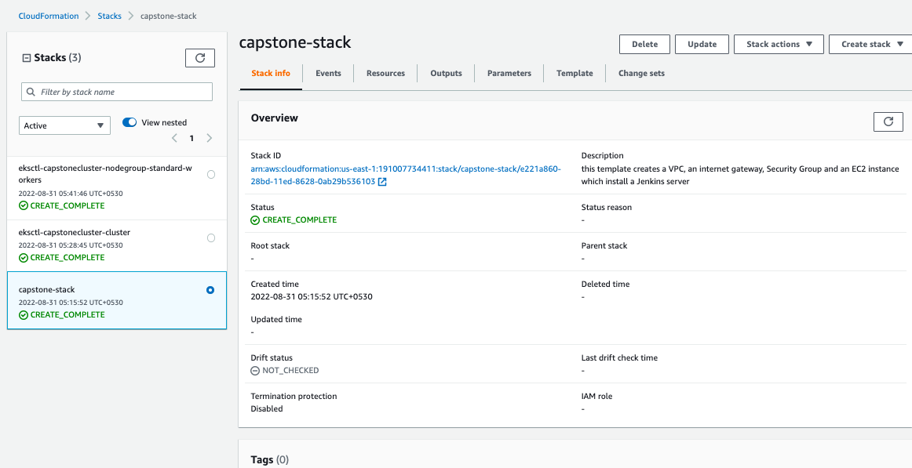

## launch configuration that will trigger EC2 Instance 
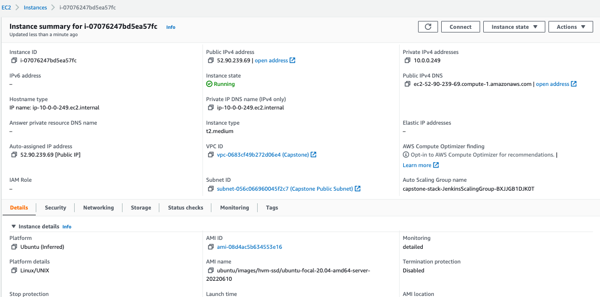

## Note Down the Public IP Address to launch Jenkins `http://<EC2_PUBLIC_IP>:8080`
[launch jenkins](http://ec2-52-90-239-69.compute-1.amazonaws.com:8080/) - to launch jenkins

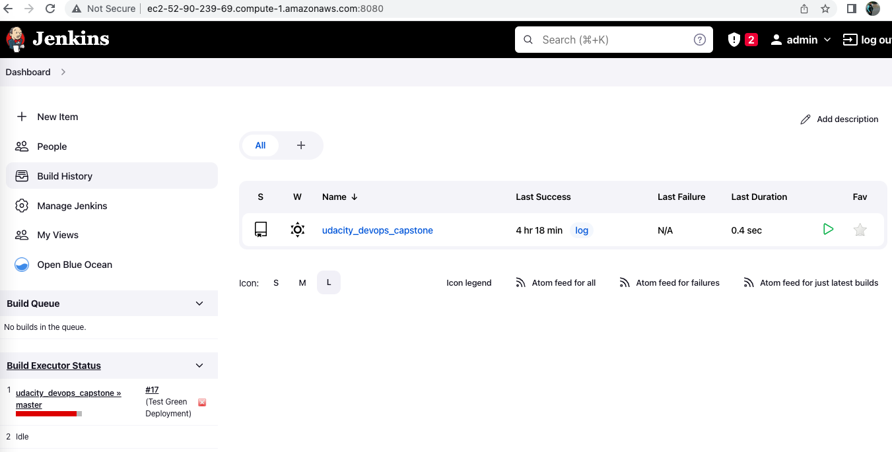

Login using admin account and complete the initial setup of Jenkins.
## Install the following plugins in Jenkins:
 -   [CloudBees AWS Credentials](https://plugins.jenkins.io/aws-credentials/)
 -   [Pipeline: AWS Steps](https://plugins.jenkins.io/pipeline-aws/)
 -   [Blue Ocean](https://plugins.jenkins.io/blueocean/)
 -   [Docker Pipeline](https://plugins.jenkins.io/docker-workflow/)

## Create a pipeline using the Blue Ocean plugin, with the following repository
 - [Udacity Project Capstone](https://github.com/itsmebharat84/udacity_devops_capstone)
 
 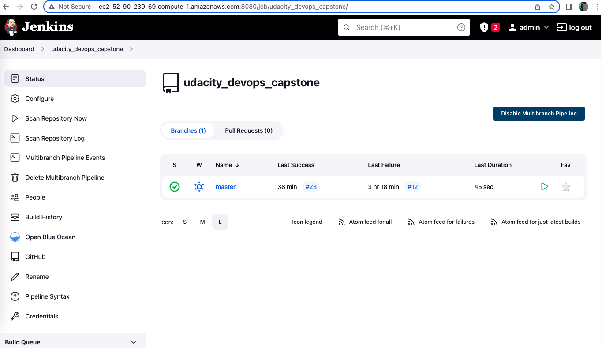

## Update Jenkins with **AWS** and **Docker** credentials

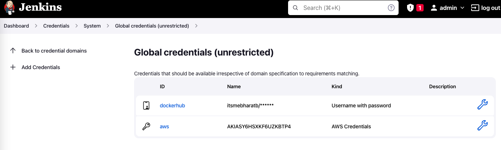

# 2. Provision EKS Cluster to perform Blue Green Deployment

## Create the EKS Cluster

- Connect to the Jenkins EC2 host 
- Install awscli, kubectl, eksctl , if not installed or outdated. 

We have to configure the `kubectl` context to target the **EKS** Cluster.

connect via ssh to the EC2 instance and run the following scripts:

- Run `aws configure` and provide your key and secret 
- Ensure region is set to **us-east-1**
- Run the below script to create the EKS cluster.

```shell script
eksctl create cluster \
    --name capstonecluster \
    --version 1.14 \
    --nodegroup-name standard-workers \
    --node-type t2.small \
    --nodes 2 \
    --nodes-min 1 \
    --nodes-max 3 \
    --node-ami auto \
    --region us-east-1 \
    --zones us-east-1a \
    --zones us-east-1b \
    --zones us-east-1c 
```
 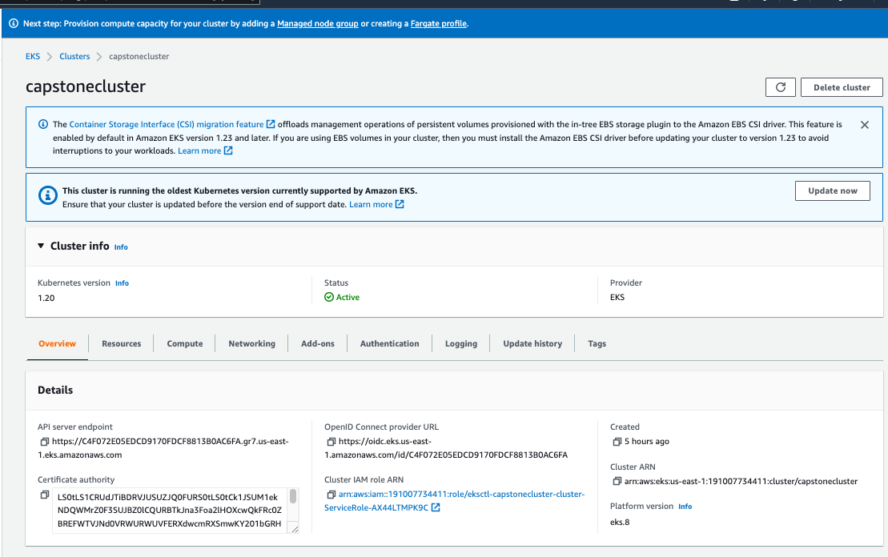
 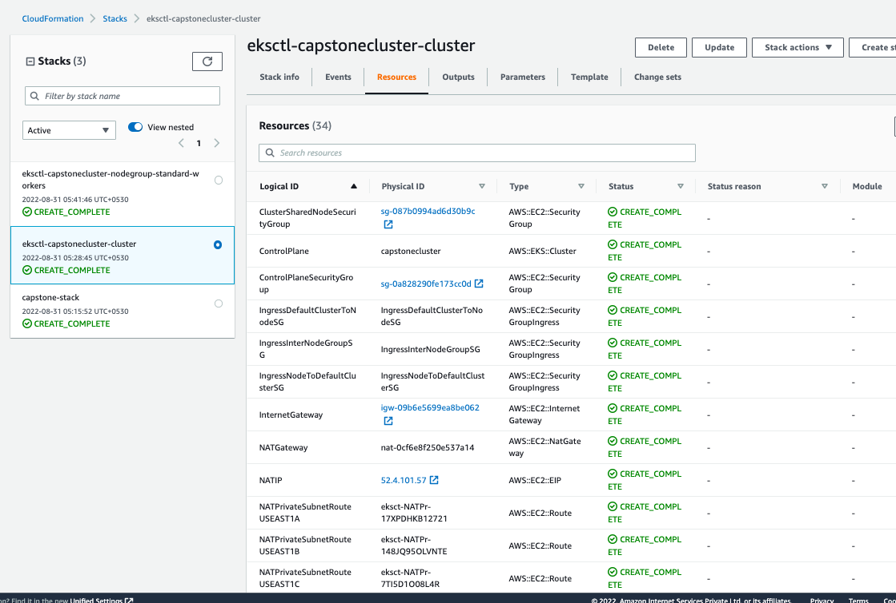
 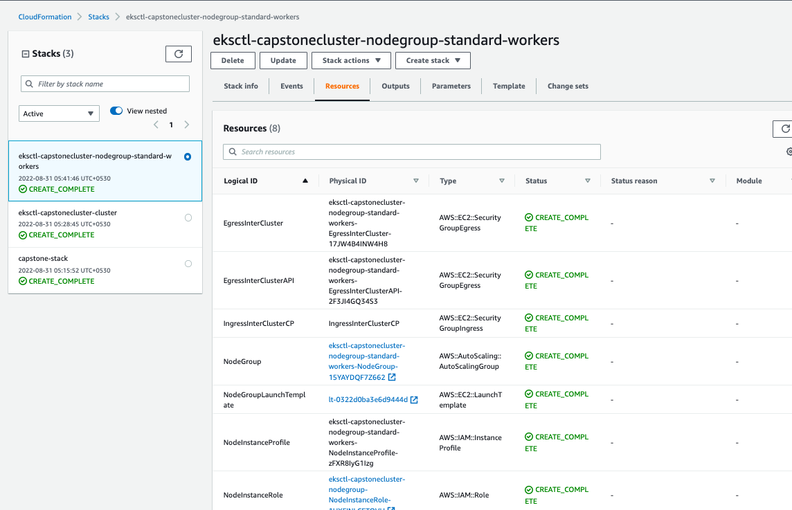


- Configure `kubectl`
```shell script
aws eks --region eu-west-2 update-kubeconfig --name capstonecluster
```
- Set Context 
```shell script
kubectl config set-context arn:aws:eks:us-east-1:191007734411:cluster/capstonecluster
```
 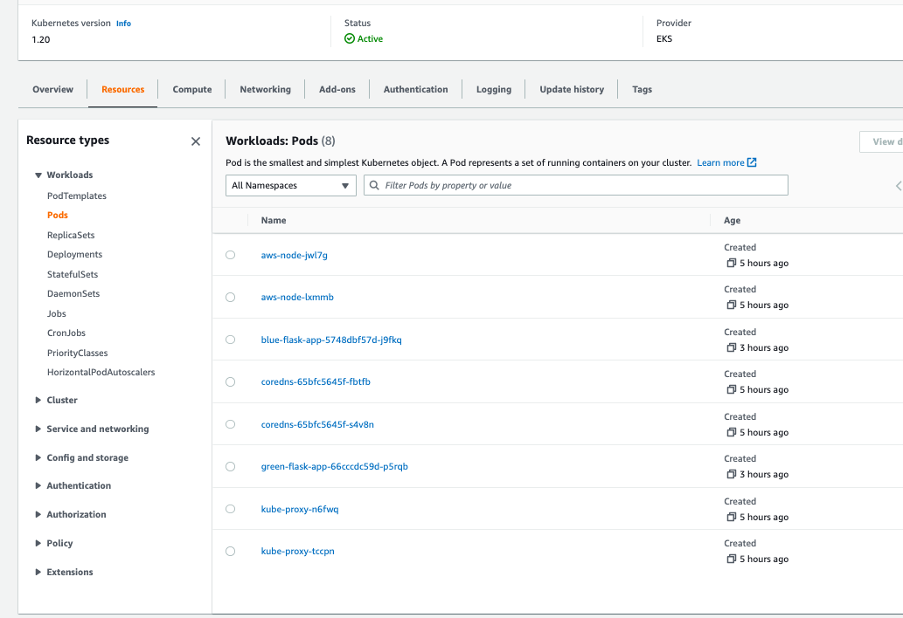

 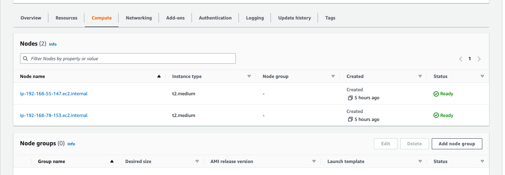

 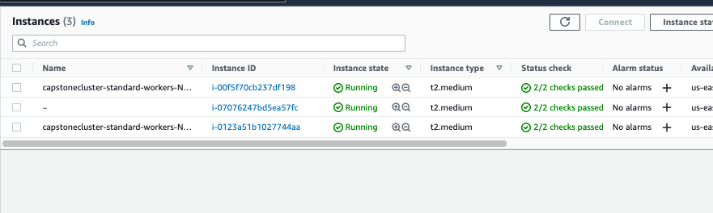