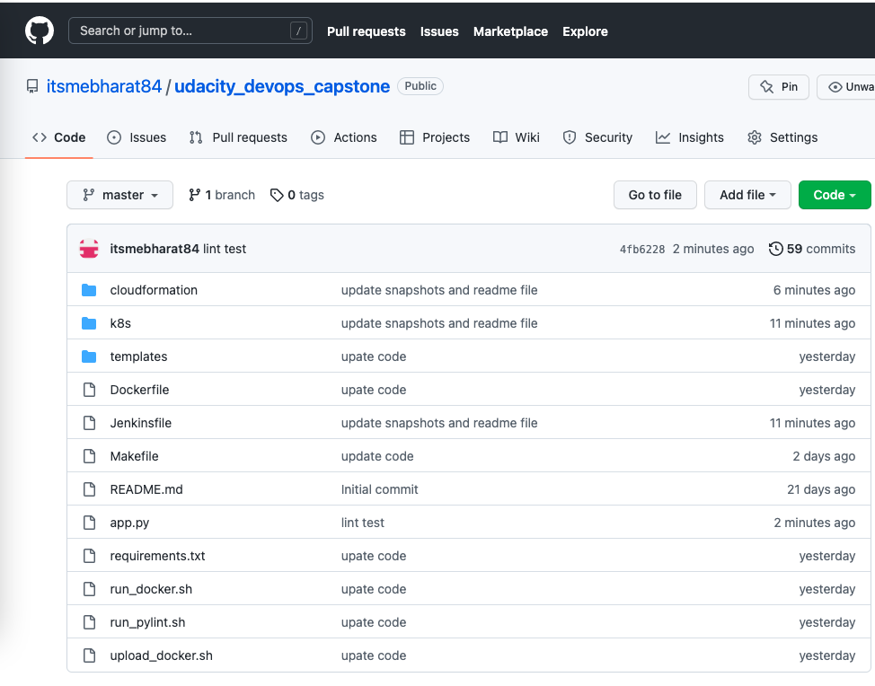
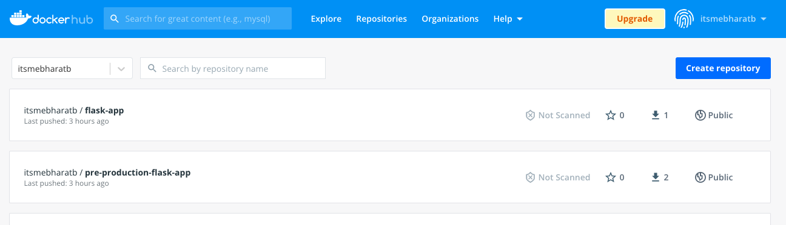
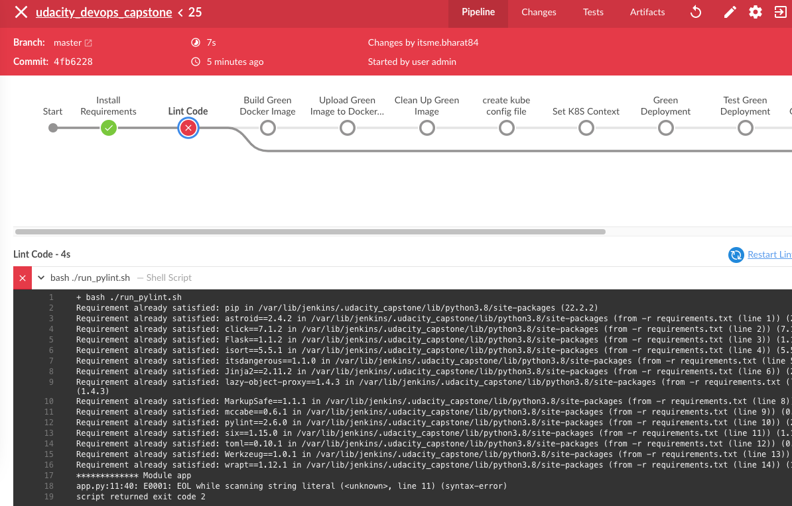

# Capstone - Cloud DevOps 

## Set Up Pipeline

### Create Github repository with project code.
``` https://github.com/itsmebharat84/udacity_devops_capstone 
```


### Use image repository to store Docker images
``` https://hub.docker.com/repositories
```  


### Execute linting step in code pipeline


The project takes a Dockerfile and creates a Docker container in the pipeline.

Successful Deployment

CRITERIA
MEETS SPECIFICATIONS
The Docker container is deployed to a Kubernetes cluster

The cluster is deployed with CloudFormation or Ansible. This should be in the source code of the student’s submission.

Use Blue/Green Deployment or a Rolling Deployment successfully

The project performs the correct steps to do a blue/green or a rolling deployment into the environment selected. Student demonstrates the successful completion of chosen deployment methodology with screenshots.